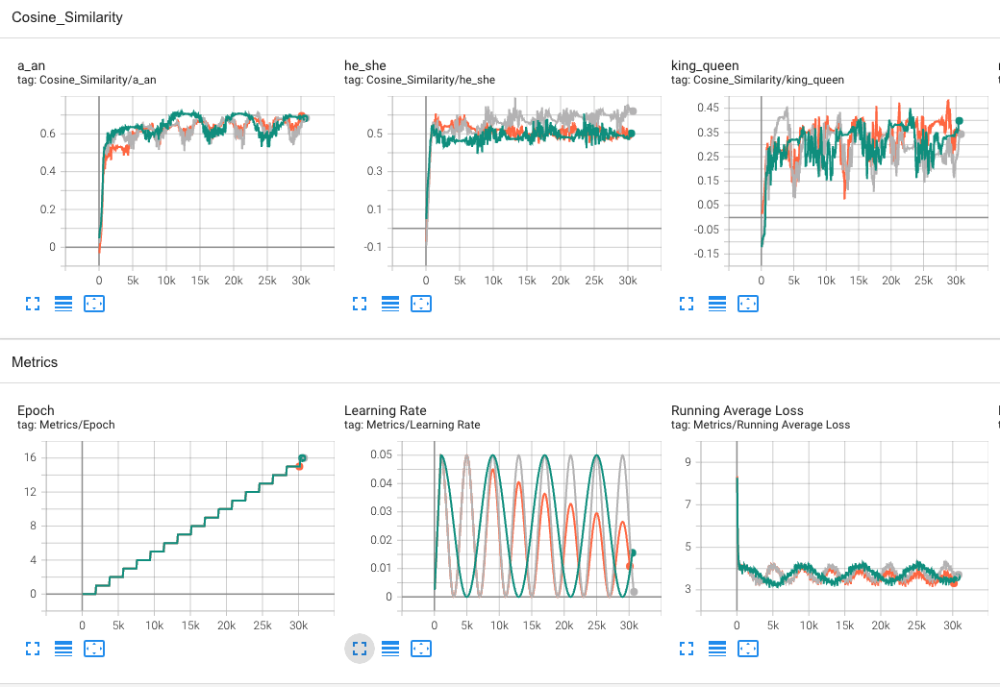

# llm_experimentation
Just me playing around with LLMs

# wiki dataset
I have been using [this dataset](https://blog.salesforceairesearch.com/the-wikitext-long-term-dependency-language-modeling-dataset/).
```bash 
wget https://s3.amazonaws.com/research.metamind.io/wikitext/wikitext-103-v1.zip
```

# tokenize data
The first step is to tokenize the data and save that to hdf5 for quicker training loops

Run that using this command:
```bash
CONTEXT_SIZE=2
python tokenize_data.py -d ./wikitext-103-raw/wiki.train.raw -t ./wikitext-103-raw/wiki.train.raw.json -o ./wikitext-103-raw/wiki.train.raw.tokens.symmetric.c2.h5 -c ${CONTEXT_SIZE} -s
```


# run training

The second step is running the training loop.
`submit_polaris.sh` is an example submit script.


# monitoring

You can monitor and see the results using Tensorboard.

Example view:

